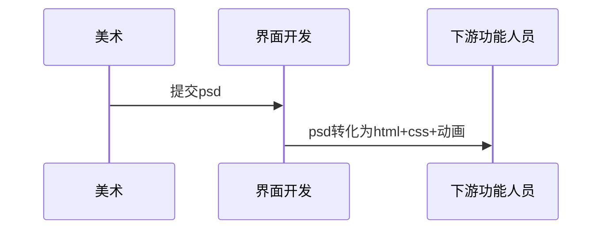
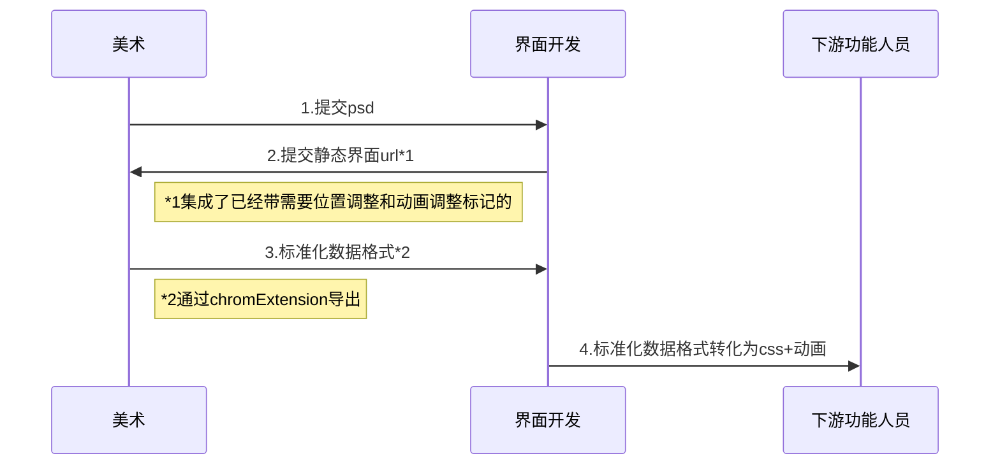

# act template

## process

## optimize point

1. 对图位置应该交给美术
1. 动画调节应该交给美术

## problems

* [ ] ~~一次成型的设计?~~
* [X] 可以二次开发的半成品导出?

## product

* [ ] chrome extension (对图位置，动画调节=>标准化数据导出)

## new process

