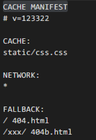

1. prerequire

    1. 指定 .appcache文件
    2. 默认缓存引入该文件的页面自动加入masterType的缓存类型
    3. appcache文件需要不缓存，且mimetype指定不然chrome会报错不能识别该offline的开关

2. appcache文件
    1. 首行必写CACHE MANIFEST
    2. #为注释
    3.section分为CACHE，NETWORK,FALLBACK
    相对路径为相对根域名

3. strange
    1. 更新的缓存并不经过network
    2. 更新appcacheFile只会让离线资源发一个ctrl+r的请求不带no-cache的requestHeader,只做lastmodify的比较，而源文件有修改的话也只是因为lastmodify更新了而做更新。
    3. 带版本号可以击穿appcache
4. p&c
